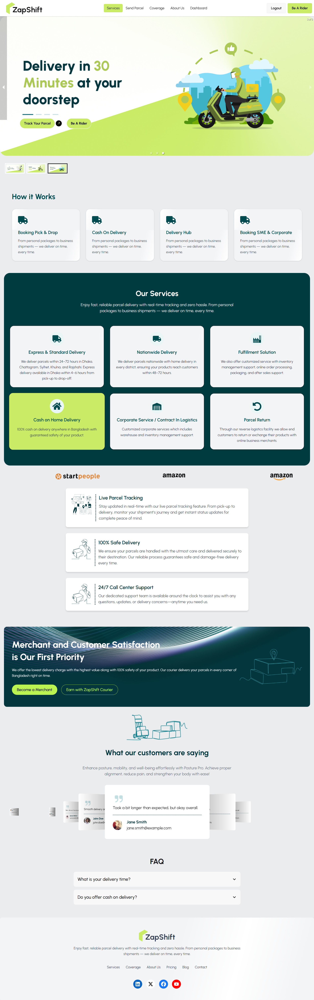

# Zap-Shift

**Zap-Shift** is a modern logistics and delivery management platform. This application provides an intuitive interface for users to book parcels, riders to manage deliveries, and administrators to oversee the entire operation. Built with React and Vite for high performance and a seamless user experience.

**🌐 Live Demo:** [https://zap-shift-e24ef.web.app](https://zap-shift-e24ef.web.app)



## 🚀 Features

### 📦 For Users

-   **Book Parcels**: Easy-to-use form to schedule parcel deliveries with automatic cost calculation.
-   **Parcel Tracking**: Real-time tracking of parcel status.
-   **Dashboard**: Manage booked parcels, view history, and handle payments.
-   **Secure Payments**: Integrated Stripe payment gateway for safe transactions.

### 🛵 For Riders

-   **Delivery Management**: View assigned deliveries and update status (Picked up, Delivered, etc.).
-   **Earnings**: Track completed deliveries and earnings.
-   **Location Integration**: Interactive maps to locate pickup and drop-off points.

### 🛡️ For Admins

-   **User Management**: Manage user roles and permissions.
-   **Rider Approval**: Review and approve new rider applications.
-   **Assign Deliveries**: Manually assign parcels to available riders.
-   **Statistics**: Overview of system performance and delivery metrics.

### 🌐 General

-   **Responsive Design**: Fully responsive UI built with Tailwind CSS and DaisyUI.
-   **Authentication**: Secure login/signup using Firebase Authentication.
-   **Interactive Maps**: Leaflet integration for visual coverage areas and tracking.
-   **Notifications**: Real-time toast notifications for user feedback.

## 🛠 Tech Stack

-   **Framework**: [React](https://react.dev/) (v19)
-   **Build Tool**: [Vite](https://vitejs.dev/)
-   **Styling**: [Tailwind CSS](https://tailwindcss.com/) v4, [DaisyUI](https://daisyui.com/)
-   **State Management**: [TanStack React Query](https://tanstack.com/query/latest)
-   **Routing**: [React Router](https://reactrouter.com/) (v7)
-   **Maps**: [Leaflet](https://leafletjs.com/) & [React Leaflet](https://react-leaflet.js.org/)
-   **Forms**: [React Hook Form](https://react-hook-form.com/)
-   **HTTP Client**: [Axios](https://axios-http.com/)
-   **Authentication**: [Firebase SDK](https://firebase.google.com/)
-   **Icons**: [React Icons](https://react-icons.github.io/react-icons/)

## ⚙️ Installation & Setup

### Prerequisites

-   Node.js (v18 or higher recommended)
-   npm or yarn

### 1. Clone the Repository

If you haven't already, clone the main repository and navigate to the client folder:

```bash
git clone <repository-url>
cd Zap-shift-code/Zap-shift-client
```

### 2. Install Dependencies

```bash
npm install
```

### 3. Environment Configuration

Create a `.env` file in the root of the `Zap-shift-client` directory. You will need credentials from your Firebase project and ImgBB (for image hosting).

```env
VITE_APIKEY=your_firebase_api_key
VITE_AUTHDOMAIN=your_project_id.firebaseapp.com
VITE_PROJECTID=your_project_id
VITE_STORAGEBUCKET=your_project_id.firebasestorage.app
VITE_MESSAGINGSENDERID=your_messaging_sender_id
VITE_APPID=your_app_id
VITE_image_host_key=your_imgbb_api_key
```

### 4. Run Development Server

```bash
npm run dev
```

The application will be available at `http://localhost:5173`.

## 📜 Available Scripts

-   `npm run dev`: Starts the development server.
-   `npm run build`: Builds the app for production.
-   `npm run lint`: Runs ESLint to check for code quality issues.
-   `npm run preview`: Locally preview the production build.

## 📂 Project Structure

```
src/
├── Components/    # Reusable UI components
├── Context/       # React Context providers (Auth, etc.)
├── Hooks/         # Custom React hooks (useAxios, useRole, etc.)
├── Layout/        # Main layout wrappers (Main, Dashboard)
├── Pages/         # Application pages (Home, Login, Dashboard views)
├── Routes/        # Router configuration and private routes
├── assets/        # Static assets (images, icons)
└── Firebase/      # Firebase initialization logic
```
